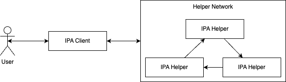
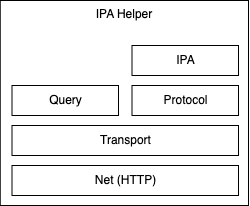

# DEVELOPMENT

This document explains the project from a developer lens and wont cover cryptography, business or goals of the project. Links to different parts of the code will be provided in this document hence it's key for first understand the [Cargo Project Layout](https://doc.rust-lang.org/cargo/guide/project-layout.html) this code follows.

## Example

Throughout these docs we'll use a simple example to help illustrate the use cases of the code.

Christian has started a burgeoning [TTPRG](https://en.wikipedia.org/wiki/Tabletop_role-playing_game) website and receives many visits each month. To support his hobby, he decided to include advertising on his website. Since Christian doesn't want to waste time finding sponsors, he reaches out to an Ad-Tech company called Garibi Corp (a Publisher), which is focused on user privacy (uses IPA). Christian installs Garibi Corp "plug-in" on his website and now Garibi needs to pick which ads to show to the website users.

Miguel has a company dedicated to [3d print miniatures](https://all3dp.com/2/3d-printing-miniatures-get-started) used in some TTRPG games and is interested in promoting his company so that he can sell more miniatures. He's an Advertiser. But Miguel is concerned about sharing his business data with Publishers, so he reaches out to Garibi Corp which specializes on privacy. Garibi thinks Miguel miniatures would go well on Christian's site and starts a campaign with some lovely banners for a month.

They let the campaign run for a month and want to check the results. Garibi Corp has a dataset with all the people that saw the Ad on Christian't website (Impressions) and Miguel kept track of the sales that came from the Ad (Conversions). Through the magic of IPA, Miguel and Garibi submit both datasets independently to an IPA helper network, which joins boths datasets a computes performance metricss. The report would give Miguel insights as to how the campaign went and to perhaps look for a different Publisher, without sharing his financials. Garibi corp would get metrics associated to how the campaign went, could pay Christian depending on it and could decide to put a different Advertiser.

# High Level

The following section explains how the above example is run using IPA from user standpoint.

Simlifying the interactions a lot, The project users submit queries to the system which are processed by multiple hosts in as part of a [secure multi-party computation](https://en.wikipedia.org/wiki/Secure_multi-party_computation). The following diagram illustrates this interaction.

The main use case is to submit Advertiser (Miguel) or Publisher (Garibi Corp) queries through a tool called Reports Collector (the executable is [report_collector.rs](./ipa-core/src/bin/report_collector.rs)). This tool takes both Impressions and Conversions datasets and submits them to the helper network using the IPA client to join both datasets together and compute metrics and generate the report securely.

Helpers can be seen as agents, each operating independently from the other in their network. Each Helper has 3 modes of operation; Waiting, Query Preparation and Computing. Helpers wait until a query comes, at which point they will coordinate with other helpers in the network. The server that receives the query becomes the query leader. If all helper nodes are ready, they accept the request, parse the inputs and carry out the computation. Once done they go back to waiting. The main executable for Helpers is [helper.rs](./ipa-core/src/bin/helper.rs).

How is the input given to the other parties in the network?

# Architecture 

Now we take a deeper dive into the modules in the IPA code exploring each of its components.

## Helper

As mentioned before, there are two modes of operation for the helper. The `Inner` struct in [app.rs](./ipa-core/src/app.rs) contains two members to help with each, the `query_processor` and `mpc_transport` used for Query Preparation and Computation respectivelly.  We'll go over a hypothetical scenario on how a query is first received and then processed. Well ignore config for now.

We use the same HTTP server both for connections from other helpers and for connections from clients (report collectors). Connections from other helpers require TLS authentication; connections from report collectors should not. Connections from report collectors should, but currently don't, have some other kind of authentication.

API

net/server/handlers/query/mod

/// Construct router for IPA query web service
///
/// In principle, this web service could be backed by either an HTTP-interconnected helper network or
/// an in-memory helper network. These are the APIs used by external callers (report collectors) to
/// examine attribution results.
pub fn query_router(transport: Arc<HttpTransport>) -> Router {
    Router::new()
        .merge(create::router(Arc::clone(&transport)))
        .merge(input::router(Arc::clone(&transport)))
        .merge(status::router(Arc::clone(&transport)))
        .merge(results::router(transport))
}

/// Construct router for helper-to-helper communications
///
/// This only makes sense in the context of an HTTP-interconnected helper network. These APIs are
/// called by peer helpers to exchange MPC step data, and by whichever helper is the leader for a
/// particular query, to coordinate servicing that query.
//
// It might make sense to split the query and h2h handlers into two modules.
pub fn h2h_router(transport: Arc<HttpTransport>) -> Router {
    Router::new()
        .merge(prepare::router(Arc::clone(&transport)))
        .merge(step::router(transport))
        .layer(layer_fn(HelperAuthentication::new))
}

echo

helpers/transport/routing
pub enum RouteId {
    Records,
    ReceiveQuery,
    PrepareQuery,
    QueryInput,
    QueryStatus,
    CompleteQuery,
}

Role

helpers/mod
Represents a unique role of the helper inside the MPC circuit. Each helper may have different
/// roles in queries it processes in parallel. For some queries it can be `H1` and for others it
/// may be `H2` or `H3`.
/// Each helper instance must be able to take any role, but once the role is assigned, it cannot
/// be changed for the remainder of the query.

H1 (leader), H2, H3

directions: left right

Route

query_config:
size
field_type
query_type

prepare_query:
query_id
config
roles

query:
create
prepare
input (data)
step
status
results

### By Layers

We'll use the following diagram to describe the internals of the helper. On it, the boxes at the top use the boxes under them. Some of the boxes map to certain modules but not of them do. We refer to boxes in the diagram using the number next to them in parenthesis (e.g. (2) refers to Transport).

The query processor (1) is defined in [processor.rs](ipa-core/src/query/processor.rs) in the larger [query module](ipa-core/src/query/mod.rs). It makes sure queries are coordinated and each party starts processing it when it has all the information required. The Processor's Rustdoc explains the steps when a query is received in more detail.

Query processor uses the [Transport] layer (2) which is a backend agnostic to send and receive information from other helpers. Transport exposes generic send and receive methods.

The net layer (3) implements the transport "inferface" using HTTP. There's also an in-memory implementation. There's an MPCClient and Server. Each helper will have one mpcclient for each other helper in the network to comunicate. We use certificates (explain) and streaming.

Once a query has been started it will contain what protocol to execute. One such high-level protocol is IPA (4) but other more simpler protocols exist and they are all defined in the (5) Protocol layer. We go into more details as to what exactly is a protocol later in this document, but for now just know that this is an algorythm that helpers will be running for which they will need to keep comunicating with other helpers to move forward. For this communication, Protocols rely on a [Gateway] which is also part of the Transport Layer (2). A gateway provides a higher level interface on top of a simple Transport providing buffering and batching which are required for efficient communication. During Computing phase the same Net (3) layer is used as for querying (this could change in the future).

## Client

cli. Common toolkit for. Encrypting input.
playbook: these are scenarios we run on the client to execute various queries end-to-end. like for IPA we get a file input, secret share and encrypt, send to MPC and get results

## IPA

Multi-Party Computation (MPC) is a protocol and computational model. It can be likened to a CPU, but with a limited set of operations - only Addition and Multiplication are directly supported. Other operations such as Not, Xor, and And are constructed using these basic operations.
The circuits in MPC are predefined and do not allow for user customization or submission as part of the input.
IPA is an example of a large MPC circuit that processes many events. There are five types of queries that can be made, including IPA and Logistic queries. The output of these queries is typically presented as a histogram.

MPC is a computational model, protocol.
MPC is like a CPU. InMPC we only have Addition and multiplication. Not, Xor, And are built on top of that.
Circuits are pre-defined, they arent submitted as part of the input or allow for user customization.
IPA IS a circuit. Huge MPC circuit. Takes many events.
5 types of queries. IPA query. Logistic query.
Output is a histogram.

Base of the domain layer
Finite field math
Used for secret sharing
Check wiki page

Boolean fields is what we’re currently using, before we used Prime fields.

src/secret_sharing
Uses ff
Properties: replicated or vectorized 
Replicated: not just sending data, might get los or malicious
Vectorized: bit alone (from boolean ff) is too inefficient, 63 bits are lost. packing into 8bytes

PRSS -> Pseuroransom secret sharing. Used for multiplication.
Diffe-Hellman to create the same seed in two helpers securely.
Shuffle; generate a random key using the seed. Re arrange based on this seed.
We do the shuffles in group of 2… 3 times.
We do the OPRF (this groups by the time so that we can shard). Some multiplications.
Small protocol for attribution. Small sort on the timestamp. We do attribution on MPC.
We use the breakdown key. (Add in FB for Amazon product. How many conversions for eclipse vs batteries vs spatulas. In the us vs europe. These are ways to group the secret shares. They have noise. Bucket identifier)
We add some noise.

MPC: protocols , secret_sharing, ff (finite field)
Protocol:
Basics
Boolean
Dp: differential privacy. Not a lot here. DP noise.
Ipa prf => ipe v2. Shared version. No sorting oprf. Oblivious pseudo- random function. Prevent timing attacks.
New version of malicious_security. In this folder. Based on max.
prss -> generate randomness. A shared random number. With either on the left or on the right. diffie hellman. Provided through the context.
Protocol is the same, context changes.
context: distinguish between these 2 important.
Malicious
semi_honest
Validation is cheap for semi-honest, malicious is expensive. Protocol chooses when to validate

# Testing

end to end integ tests that use bins
for benches we have:
ioa
no mocks, but in-memory infra
small circuits
Create keys and setups ports
